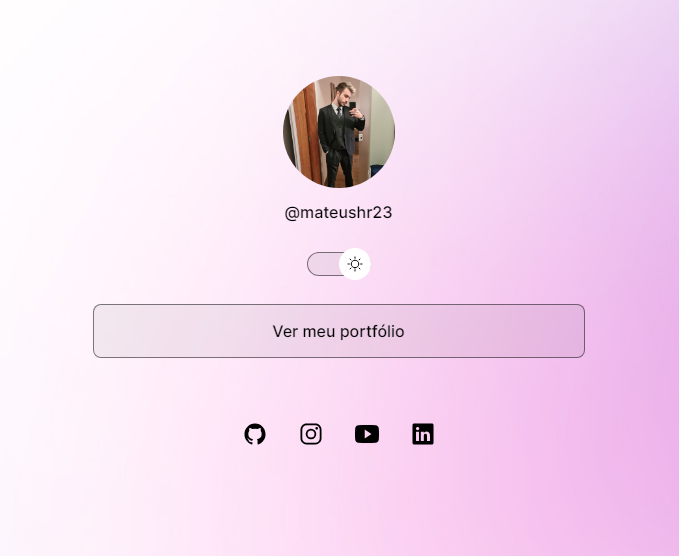

<h1 align="center"> Portfólio </h1>

Projeto realizado no curso Discover da [Rocketseat](https://www.rocketseat.com.br) com o objetivo de criar um portfólio para o usuário.

  

## 🚀 Tecnologias

Esse projeto foi desenvolvido com as seguintes tecnologias:

- HTML e CSS
- JavaScript
- Git e Github
- Figma

## 🔖 Layout

Você pode visualizar o layout do projeto através [DESSE LINK](<https://www.figma.com/file/m9nWbpdGWJ9vZKLmKsOliP/DevLinks-%E2%80%A2-Projeto-Discover-(Community)?type=design&node-id=10-620&mode=design&t=W7l4cK9mNl1xVy5X-0>). É necessário ter conta no [Figma](https://figma.com) para acessá-lo.
